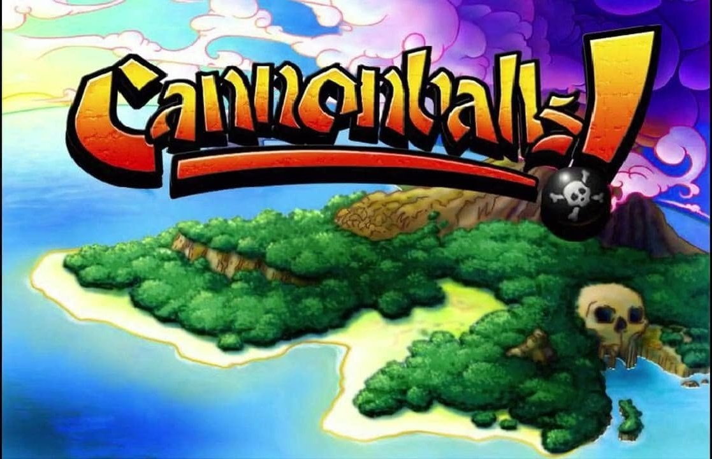

# Cannonballs! — source & reverse-engineering

The decompiled **source code** of WildTangent's 2002 pirate-artillery game
*Cannonballs!*, plus the reverse-engineered decoders for its proprietary asset
formats — everything needed to understand how the game actually works. Native
rebuilds that run on the original assets are included as **downstream
projects**: playable macOS and Windows builds, both consuming
the same platform-neutral research, specs, and decoded assets. The whole
pipeline — installer → decompiled source → decoded assets → rebuilds —
lives in this one repo; see **[`PIPELINE.md`](PIPELINE.md)**.



## Download & play 🎮

Both builds are self-contained (original assets baked in, no separate download):

- **macOS** (13+, Apple Silicon or Intel) — **[Cannonballs-macOS.dmg](https://github.com/CannonballsResurrection/Cannonballs-Resurrection/releases/latest/download/Cannonballs-macOS.dmg)**
  Open the .dmg and drag **Cannonballs!** into Applications.
  **Getting past Gatekeeper:** this is a free fan project, so it isn't signed with a
  paid Apple Developer certificate. On first launch macOS will say the app is from an
  *"unidentified developer"* and refuse to open it on a normal double-click. To bypass
  that: **right-click (or Control-click) the app → Open**, then click **Open** in the
  dialog. You only have to do this once; after that it launches normally. (If macOS
  offers no Open button at all, run `xattr -dr com.apple.quarantine
  /Applications/Cannonballs\!.app` in Terminal, then open it.)
- **Windows** (10/11, 64-bit) — **[Cannonballs-Windows.zip](https://github.com/CannonballsResurrection/Cannonballs-Resurrection/releases/latest/download/Cannonballs-Windows.zip)**
  Unzip anywhere and run `Cannonballs.exe`.
  **Getting past SmartScreen:** because the app isn't signed with a paid code-signing
  certificate, Windows Defender SmartScreen will show a blue *"Windows protected your
  PC"* box the first time you run it. This is expected for any small/independent app,
  not a virus warning. To bypass it: click **More info**, then the **Run anyway**
  button that appears. (Some browsers also flag the .zip on download. choose **Keep**
  to save it.)
  **Known issue:** There is a known bug in the Windows app where, upon entering the
  game, it gets garbled and shows the main menu. Just quit the app and reopen it, the
  issue should resolve itself. I'm working on fixing that.

Both links always point at the newest build on the
**[Releases page](https://github.com/CannonballsResurrection/Cannonballs-Resurrection/releases/latest)**.
To refresh them, run **`./tools/publish.sh`** — it rebuilds both installers, re-syncs
the local macOS copies (`~/Documents/Cannonballs`, `/Applications`), and re-uploads
the same-named assets to the latest release, so these links never go stale. (Build
the pieces individually with `macos/tools/make_dmg.sh` / `windows/tools/package_win.sh`.)

## The core: how the game works

- **[`source/`](source/)** — the game's decompiled Java (CFR output). The reference
  of record; start with [`source/README.md`](source/README.md) for a reading order.
  Weapon tables, turn flow, physics, the 800×600 UI layout — it's all here.
  [`source/engine/`](source/engine/) holds the WildTangent WebDriver API it calls,
  so the codebase resolves and reads as a whole.
- **[`raw/`](raw/)** — the provenance root: the original installer, the extracted
  `game.jar`, and the encoded `game-media/` assets everything is derived from.
- **[`format-research/`](format-research/)** — write-ups + decode specs for the
  WLD3 asset formats, reverse-engineered from the engine and the source:

  | Format | What it hid | Status |
  |---|---|---|
  | `.wwv` audio | rolling-XOR + CAB/MSZIP around RIFF/WAVE | ✅ decoded |
  | `.wsgo` / VIPM meshes | byte-planar 16-bit quantized geometry | ✅ decoded |
  | `.wjp` images | WLD3 container around plain JPEG | ✅ decoded |
  | textures / maps / props | WLD3 container blocks | ✅ decoded |

- **[`tools/`](tools/)** — our extraction/decode scripts (container, audio, mesh, image).
- **[`third-party/WTExtractor`](https://github.com/diamondman/WTExtractor)** — the vendored community
  WLD3 toolchain our tools build on, kept as a pinned submodule of our fork (attribution inside).
- **[`source/engine/native/dlls/`](source/engine/native/dlls/)** — recovered WildTangent engine DLLs used to
  crack the formats (provenance inside).
- **[`decoded-assets/`](decoded-assets/)** — decoded original audio + menu-art masters.
- **`PIPELINE.md`** — the end-to-end flow. **`HANDOFF.md` / `ROADMAP.md`** — resume point + what's left.

## Downstream: the native rebuilds

> **Why reimplement instead of running the original engine?** WildTangent's WT
> runtime was native, proprietary, and is lost, so there is no binary to boot.
> But even if there were, a clean reimplementation is the *more* faithful path,
> not a fallback. The game's fidelity lives in three recoverable layers: the
> original **assets**, the **game logic** (the decompiled Java, transcribed
> verbatim: every coordinate, formula, draw order, timing, and sentinel), and
> the **engine conventions** (rotation signs, anchor points, handedness) we pin
> one API at a time. The runtime was only the substrate that executed the Java's
> drawing and math calls; re-hosting those same calls on SceneKit/Godot against
> the same conventions yields identical pixels. What emulation would add (memory
> layout, internal dispatch) produces no visible difference, while transcription
> buys what a lost black box can't: every value cites `File.java:line`, results
> diff against the reference frames, and it runs natively on both macOS and
> Windows. This is *resurrection* (inspectable, portable, maintainable), not
> preservation of an untouched binary.

- **[`shared/Resources/`](shared/Resources/)** — the platform-neutral decoded
  asset tree (textures, meshes, audio, maps, fonts, help pages) produced by
  `tools/` and consumed by **every** build. One tree, no per-platform copies.
- **[`macos/`](macos/)** — a from-scratch Swift/SceneKit reimplementation that
  plays the original game on Apple Silicon/Intel, built directly from the
  understanding in `source/`:

  ```sh
  cd macos && swift run -c release      # macOS 13+, Xcode CLT
  cd macos && ./tools/package_app.sh    # assemble/refresh Cannonballs!.app
  cd macos && ./tools/make_dmg.sh       # build the .dmg + sync the installed copies
  ```

  It reproduces the original flow (Your Name → New Game Settings → Lobby →
  battle), the 800×600 UI, all 11 islands, 12 weapons, bots, wind, and
  deformable terrain.
- **[`windows/`](windows/)** — a complete Godot 4 (GDScript, `gl_compatibility`)
  port, feature-matched to the macOS build file-for-file against the same Java
  reference and `shared/Resources/` tree. Verified end-to-end under Wine.

  ```sh
  godot --path windows                  # run the port natively
  ./windows/tools/package_win.sh        # headless export + package windows/dist/
  ```

## Standing on Kenneth's shoulders 🏴‍☠️

This work builds on **Kenneth** (htennek98 / CaptSmokey6 / CrazyCannon), who kept
Cannonballs! alive for years with his **Cannonballs! Resurrection** project — the
website, the "Access all Islands" patch, and the community around it. His project,
preserved as-is, lives in [`resurrection-archive/`](resurrection-archive/), with
full credit in [`resurrection-archive/CREDITS.md`](resurrection-archive/CREDITS.md).

## Legal

Non-commercial preservation of a discontinued product (IP held by Gamigo). The
decompiled source, engine DLLs, and game assets are © the rights holder and are
included for study, preservation, and interoperability. See [`LEGAL.md`](LEGAL.md)
for details and a takedown contact.
